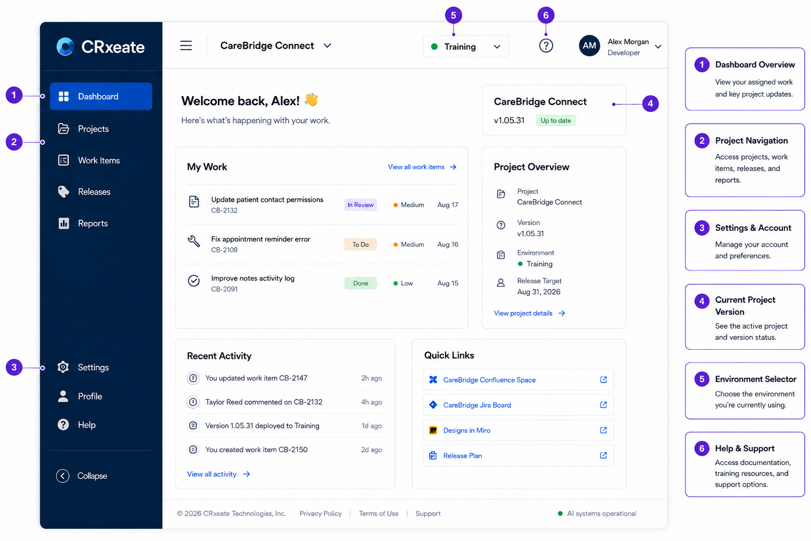

# CareBridge Team Onboarding Guide

> **Portfolio Sample:** This fictional internal documentation sample demonstrates onboarding content for a healthcare software team. All company names, products, people, and workflows are fictional.

**Current Product Version:** v1.06.00  
**Last Updated:** September 2026  
**Document Owner:** CareBridge Documentation Team

---

## Welcome

Welcome to the CareBridge team!

CareBridge develops software that helps mental health professionals coordinate care for shared patients.

This guide will help you:

- Access required tools and systems
- Understand the CareBridge Connect product
- Locate project information
- Learn the team's core workflow
- Prepare for your first assignment

**Audience:** New team members joining the product and QA teams  
**Purpose:** Help new team members access required tools, understand documentation standards, and complete their initial setup.  
**Scope:** This guide covers general onboarding for product and QA team members. Role-specific training and access requirements may vary.

### About CareBridge Connect

**CareBridge Connect** is a secure patient coordination portal designed for mental health professionals who support the same patient.

Authorized providers, including therapists, psychiatrists, and care coordinators, can use the portal to access relevant patient information and communicate with other members of the treatment team.

By centralizing communication, CareBridge Connect reduces reliance on phone calls and disconnected follow-ups between providers.

## 1. Team & Project Overview

### Development Platform

CareBridge Connect is developed and maintained using **CareBridge Workspace**, the team's browser-based development and configuration platform.

During onboarding, new team members use a training environment containing mock patient data.

> **Important:** Do not enter real patient information into the CareBridge Workspace training environment.

## 2. Team Schedule

### Daily Stand-Up

The team meets each business day for a short stand-up.

Be prepared to briefly discuss:

- Your current assignment
- Progress since the previous stand-up
- Planned work for the day
- Questions or blockers

### Company Meeting

A company-wide meeting is held on the **third Thursday of each month**.

Topics may include:

- Product and release updates
- Department announcements
- Upcoming company goals
- Process or policy changes
- Team recognition

### Release Schedule

Release dates and assignments are maintained in **Jira**.

Check the appropriate Jira project for:

- Current release dates
- Task-specific deadlines
- Release assignments
- Changes to planned release scope

## 3. Required Access

Confirm access to the following systems before beginning project work:

| Tool | Purpose |
| --- | --- |
| Microsoft Teams | Team communication, meetings, and project discussions |
| Company Email | Company communication and account notifications |
| Confluence | Internal documentation and project information |
| Jira | Task assignments, bugs, feature requests, and project tracking |
| Miro | Collaborative diagrams, workflows, and planning |
| Company VPN | Secure access to internal systems |
| CareBridge Workspace | Browser-based development and configuration of CareBridge Connect |
| Company SSO/MFA | Secure authentication for company systems |
| Password Manager | Approved credential storage |

Additional tools may be required depending on your role.

> **Access Issue?** Contact IT Support if you cannot access a required system.

## 4. Initial Setup

Complete the following steps during onboarding:

- [ ] Sign in to your company email.
- [ ] Sign in to Microsoft Teams.
- [ ] Confirm access to Confluence.
- [ ] Confirm access to Jira.
- [ ] Confirm access to Miro.
- [ ] Configure and test the Company VPN.
- [ ] Complete SSO and multi-factor authentication setup.
- [ ] Sign in to CareBridge Workspace.
- [ ] Review this onboarding guide.
- [ ] Join your assigned Teams channels.
- [ ] Attend scheduled onboarding and setup meetings.
- [ ] Open the CareBridge Workspace training environment.
- [ ] Explore the CareBridge Workspace interface and settings.
- [ ] Report missing access to your manager or IT Support.

## 5. Using CareBridge Workspace

CareBridge Workspace is the primary browser-based platform used to develop and configure CareBridge Connect.

### Access CareBridge Workspace

1. Connect to the **Company VPN**.
2. Open **CareBridge Workspace** in your browser.
3. Select the required CareBridge Connect environment.
4. Confirm that you are in the correct project area.
5. Complete the assigned work.
6. Record relevant implementation details in Jira.

> **Important:** Use the Training environment during onboarding unless your manager instructs you otherwise.

### Open the CareBridge Connect Project

1. From the CareBridge Workspace dashboard, select **Projects**.
2. Select **CareBridge Connect**.
3. Verify that the current version displays as **v1.06.00**.
4. Select **Workspace** to open the project.

### Review an Assigned Work Item

Before making changes in CareBridge Workspace:

1. Open your assigned Jira ticket.
2. Review the requirements and acceptance criteria.
3. Identify any referenced feature, screen, or workflow.
4. Review linked Confluence documentation.
5. Return to CareBridge Workspace.
6. Locate the related project area.
7. Review the existing configuration before making changes.

If the Jira requirements do not match the current CareBridge Workspace configuration, contact the project lead before continuing.

### Explore the Workspace

During onboarding, locate the following areas:

- **Dashboard** — View recent activity and assigned work.
- **Projects** — Access CareBridge Connect project files.
- **Settings** — Manage account and workspace preferences.
- **Environment Selector** — Confirm the environment currently in use.
- **Help** — Access CareBridge Workspace documentation and troubleshooting resources.

You do not need to make project changes during this step. The goal is to become familiar with the interface and confirm that your access is working correctly.

### CareBridge Workspace Dashboard

The CareBridge Workspace dashboard provides access to assigned work, project information, environment settings, and support resources.

[](images/carebridge
